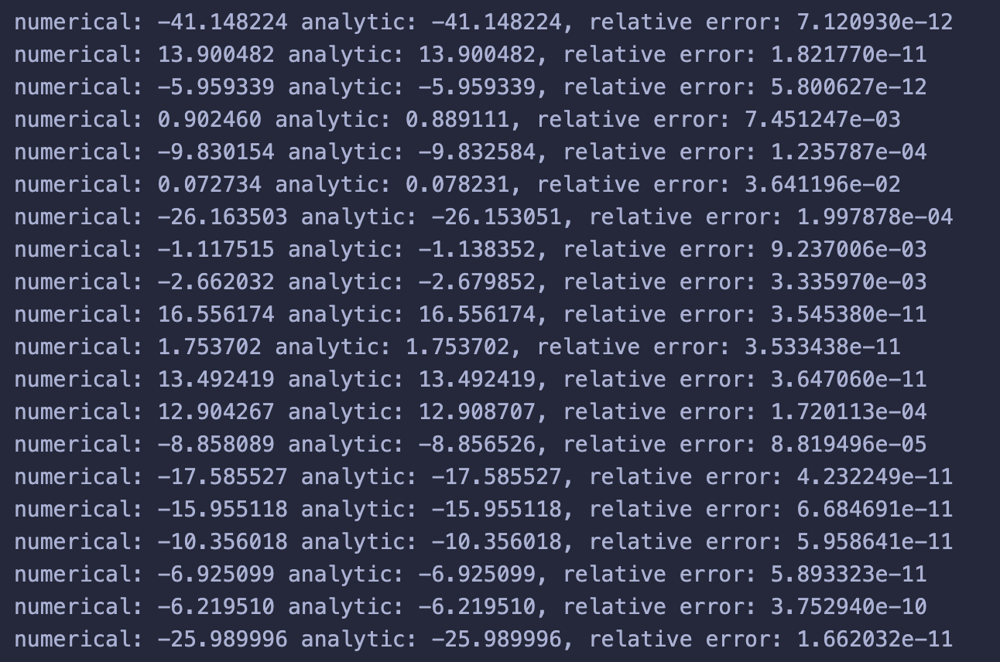
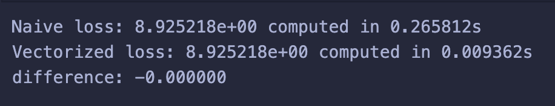
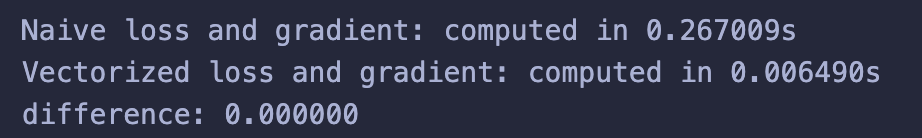
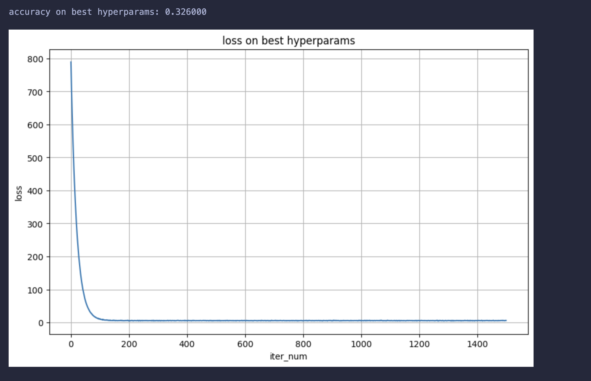

# **模式识别与机器学习 -- 实验2**

本实验包含以下部分：

-   softmax （50%） 

-   svm （50%）


## **softmax**

1 手动实现 Softmax 函数 （15%）
```python
def my_softmax(logits):
    max_logits = logits.max(dim = -1, keepdim = True).values
    exp_logits = (logits - max_logits).exp()
    sum_exp_logits = exp_logits.sum(dim = -1, keepdim = True)
    probs = exp_logits / sum_exp_logits
    
    return probs
```
1. max_logits: 沿最后一个维度（dim=-1）找到每行（即每个样本）的 logits 最大值。keepdim=True 确保其形状为 [batch_size, 1] 以便广播。
2. exp_logits: 从所有 logits 中减去该行的最大值，然后再计算指数。
3. sum_exp_logits: 计算分布归一化项
4. probs: 执行逐元素的除法，得到最终的概率分布


2 创建自定义 Softmax 层  （15%）
```python
class MySoftmax(nn.Module):
    def __init__(self, dim=-1):
        super().__init__()
        self.dim = dim
    
    def forward(self, x):
        return my_softmax(x)

```
1. 此类继承自nn.Module，是所有PyTorch层的基类
2. __init__方法中调用super().__init()，来初始化父类
3. forward方法定义了层的前向传播逻辑，直接接收输入张量 x，并调用在任务1中实现的 my_softmax(x) 函数，返回计算得到的概率。

3 参数调优实验（无需给出代码）

4 提交实验结果，只需截图最后的实验结果汇总和最佳模型的配置即可（20%）


## **svm**

### 一、损失和梯度的计算
#### 1, 循环实现中的梯度计算（10%）

补全 fduml.linear_svm import中的svm_loss_naive函数

在这里写代码，并简单说明（注意，没有说明会适当扣分）

```python
def svm_loss_naive(W, X, y, reg):
    """
    结构化SVM损失函数，朴素实现（使用循环）。

    输入数据的维度为D，共有C个类别，我们在包含N个样本的小批量数据上操作。

    输入参数:
    - W: 形状为(D, C)的numpy数组，包含权重。
    - X: 形状为(N, D)的numpy数组，包含一个小批量数据。
    - y: 形状为(N,)的numpy数组，包含训练标签；y[i] = c 表示
      X[i]的标签为c，其中 0 <= c < C。
    - reg: (float) 正则化强度

    返回一个元组:
    - loss: 单个浮点数，表示损失值
    - gradient: 关于权重W的梯度；与W形状相同的数组
    """
    dW = np.zeros(W.shape)

    num_classes = W.shape[1]
    num_train = X.shape[0]
    loss = 0.0
    for i in range(num_train):
        scores = X[i].dot(W)
        correct_class_score = scores[y[i]]
        for j in range(num_classes):
            if j == y[i]:
                continue
            margin = scores[j] - correct_class_score + 1  # note delta = 1
            if margin > 0:
                loss += margin

    loss /= num_train

    loss += reg * np.sum(W * W)

    #############################################################################
    # TODO:                                                                     #
    # 计算损失函数的梯度并将其存储在dW中。                                         #
    # 在计算损失的同时计算导数可能更简单                                           #
    # 可以修改上面的一些代码来计算梯度                                         # 
    #############################################################################
    # *****START OF YOUR CODE (DO NOT DELETE/MODIFY THIS LINE)*****

    # 循环遍历每个样本来计算梯度
    for i in range(num_train):
        scores = X[i].dot(W)
        correct_class_score = scores[y[i]]
        for j in range(num_classes):
            if j == y[i]:
                continue
            margin = scores[j] - correct_class_score + 1
            if margin > 0:
                # 对于 j != y[i] 且 margin > 0 的情况
                dW[:, j] += X[i]
                # 对正确类别 y[i] 的梯度贡献
                dW[:, y[i]] -= X[i]

    # 将梯度平均
    dW /= num_train

    # 添加正则化项的梯度
    # R(W) = reg * sum(W*W)
    # d(R(W))/dW = 2 * reg * W
    dW += 2 * reg * W

    # *****END OF YOUR CODE (DO NOT DELETE/MODIFY THIS LINE)*****

    return loss, dW
```

#### 2, 向量实现中的损失计算和梯度计算（15%）

补全 fduml.linear_svm import中的svm_loss_vectorized函数

在这里写代码，并简单说明

```python
def svm_loss_vectorized(W, X, y, reg):
    """
    结构化SVM损失函数，向量化实现。

    输入和输出与svm_loss_naive相同。
    """
    loss = 0.0
    dW = np.zeros(W.shape)

    #############################################################################
    # TODO:                                                                     #
    # 实现结构化SVM损失的向量化版本，将结果存储在loss中。                           #
    #############################################################################
    # *****START OF YOUR CODE (DO NOT DELETE/MODIFY THIS LINE)*****

    num_train = X.shape[0]

    # 计算所有分数 (N, C)
    scores = X.dot(W)

    # 获取每个样本的正确类别的分数 (N,)
    # np.arange(num_train) 提供了 [0, 1, ..., N-1] 作为行索引
    # y 提供了 [y[0], y[1], ..., y[N-1]] 作为列索引
    correct_class_scores = scores[np.arange(num_train), y]

    # 计算 margins (N, C)
    # 使用 correct_class_scores[:, np.newaxis] (将其变为 (N, 1))
    # 以便它可以与 (N, C) 的 scores 矩阵正确广播
    margins = scores - correct_class_scores[:, np.newaxis] + 1.0  # delta = 1

    # 将正确类别 (j == y[i]) 的 margin 设置为 0
    margins[np.arange(num_train), y] = 0

    # 应用 max(0, margin)
    margins = np.maximum(0, margins)

    # 计算总损失，对所有样本和所有类别求和
    loss = np.sum(margins)

    # 平均损失
    loss /= num_train

    # 添加正则化损失
    loss += reg * np.sum(W * W)

    # *****END OF YOUR CODE (DO NOT DELETE/MODIFY THIS LINE)*****

    #############################################################################
    # TODO:                                                                     #
    # 实现SVM损失梯度的向量化版本，将结果存储在dW中。                               #
    # 提示：与其从头计算梯度，重用一些损失计算时的中间值可能更容易                   #
    #############################################################################
    # *****START OF YOUR CODE (DO NOT DELETE/MODIFY THIS LINE)*****

    binary_mask = (margins > 0).astype(float)

    # 计算每个样本 i 有多少个 j 使得 margin > 0 (N,)
    counts = np.sum(binary_mask, axis=1)

    # 在正确类别 y[i] 的位置设置 -counts[i]
    # 这代表了对于 W_{y_i} 的梯度贡献
    binary_mask[np.arange(num_train), y] = -counts

    # 计算梯度 dW = X^T * binary_mask
    # (D, N) x (N, C) -> (D, C)
    dW = X.T.dot(binary_mask)

    # 平均梯度
    dW /= num_train

    # 添加正则化梯度
    dW += 2 * reg * W

    # *****END OF YOUR CODE (DO NOT DELETE/MODIFY THIS LINE)*****

    return loss, dW
```

#### 3, 在这里提交ipynb中的相关检查结果（不占额外分数，但这是判断上面的实现是否正确的重要依据




### 二、实现SGD 
代码+简单说明（10%）
```python
def train(
        self,
        X,
        y,
        learning_rate=1e-3,
        reg=1e-5,
        num_iters=100,
        batch_size=200,
        verbose=False,
    ):
        """
        使用随机梯度下降训练该线性分类器。

        输入:
        - X: 形状为 (N, D) 的 numpy 数组，包含训练数据；有 N 个训练样本，每个样本的维度为 D。
        - y: 形状为 (N,) 的 numpy 数组，包含训练标签；y[i] = c 表示 X[i] 的标签为 0 <= c < C，其中 C 是类别数。
        - learning_rate: (float) 优化的学习率。
        - reg: (float) 正则化强度。
        - num_iters: (integer) 优化时的迭代步数
        - batch_size: (integer) 每一步使用的训练样本数量。
        - verbose: (boolean) 如果为 true，在优化过程中打印进度。

        输出:
        包含每次训练迭代中损失函数值的列表。
        """
        num_train, dim = X.shape
        num_classes = (
            np.max(y) + 1
        )  # 假设 y 的取值为 0...K-1，其中 K 是类别数
        if self.W is None:
            # 延迟初始化 W
            self.W = 0.001 * np.random.randn(dim, num_classes)

        # 运行随机梯度下降以优化 W
        loss_history = []
        for it in range(num_iters):
            X_batch = None
            y_batch = None

            #########################################################################
            # TODO:                                                                 #
            # 从训练数据中采样 batch_size 个元素及其对应的标签，用于本轮梯度下降。        #
            # 将数据存储在 X_batch 中，对应的标签存储在 y_batch 中；采样后 X_batch 的     #
            # 形状应为 (batch_size, dim)，y_batch 的形状应为 (batch_size,)            #
            #                                                                       #
            # 提示: 使用 np.random.choice 生成索引。有放回采样比无放回采样更快。          #
            #########################################################################
            # *****START OF YOUR CODE (DO NOT DELETE/MODIFY THIS LINE)*****

            # 从训练数据中随机选择 batch_size 个索引
            indices = np.random.choice(num_train, batch_size, replace=True)
            # 使用索引获取小批量数据和标签
            X_batch = X[indices]
            y_batch = y[indices]

            # *****END OF YOUR CODE (DO NOT DELETE/MODIFY THIS LINE)*****

            # 评估损失和梯度
            loss, grad = self.loss(X_batch, y_batch, reg)
            loss_history.append(loss)

            # 执行参数更新
            #########################################################################
            # TODO:                                                                 #
            # 使用梯度和学习率更新权重。                                              #
            #########################################################################
            # *****START OF YOUR CODE (DO NOT DELETE/MODIFY THIS LINE)*****

            # 应用梯度下降更新规则
            self.W -= learning_rate * grad

            # *****END OF YOUR CODE (DO NOT DELETE/MODIFY THIS LINE)*****

            if verbose and it % 100 == 0:
                print("iteration %d / %d: loss %f" % (it, num_iters, loss))

        return loss_history

    def predict(self, X):
        """
        使用该线性分类器的训练权重预测数据点的标签。

        输入:
        - X: 形状为 (N, D) 的 numpy 数组，包含训练数据；有 N 个训练样本，每个样本的维度为 D。

        返回:
        - y_pred: X 中数据的预测标签。y_pred 是一个长度为 N 的一维数组，每个元素是一个整数，表示预测的类别。
        """
        y_pred = np.zeros(X.shape[0])
        ###########################################################################
        # TODO:                                                                   #
        # 实现此方法。将预测标签存储在 y_pred 中。                                    #
        ###########################################################################
        # *****START OF YOUR CODE (DO NOT DELETE/MODIFY THIS LINE)*****

        # 计算分数 (N, C)
        scores = X.dot(self.W)
        # 找到每个样本分数最高的类别的索引
        y_pred = np.argmax(scores, axis=1)

        # *****END OF YOUR CODE (DO NOT DELETE/MODIFY THIS LINE)*****
        return y_pred
```

### 三、利用验证集做超参数调优 
表格记录（5*5），可以自己尝试不同的组合 （10%）

| 学习率 \ 正则化强度 | 0.001       | 0.01        | 0.1         | 1.0         | 10.0        |
| :----------------- | :---------- | :---------- | :---------- | :---------- | :---------- |
| **0.0001**         | 0.3090      | 0.3070      | 0.2920      | 0.3330      | 0.2870      |
| **0.001**          | 0.2840      | 0.3040      | 0.2790      | 0.2660      | 0.2230      |
| **0.01**           | 0.3080      | 0.3110      | 0.2750      | 0.2500      | 0.1950      |
| **0.1**            | 0.2770      | 0.2560      | 0.2370      | 0.1800      | 0.0870      |
| **1.0**            | 0.2510      | 0.2420      | 0.2000      | {结果}      | 0.0870      |

最优的结果的loss曲线截图和正确率截图（5%）



