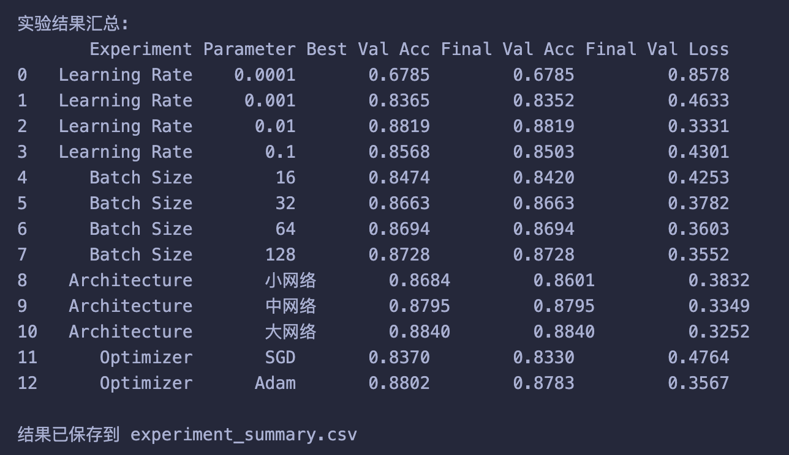
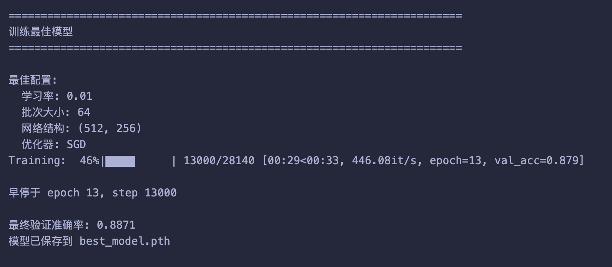

# **模式识别与机器学习 -- 实验2**

本实验包含以下部分：

-   softmax （50%） 

-   svm （50%）


## **softmax**

1 手动实现 Softmax 函数 （15%）
```python
def my_softmax(logits):
    max_logits = logits.max(dim = -1, keepdim = True).values
    exp_logits = (logits - max_logits).exp()
    sum_exp_logits = exp_logits.sum(dim = -1, keepdim = True)
    probs = exp_logits / sum_exp_logits
    
    return probs
```
1. max_logits: 沿最后一个维度（dim=-1）找到每行（即每个样本）的 logits 最大值。keepdim=True 确保其形状为 [batch_size, 1] 以便广播。
2. exp_logits: 从所有 logits 中减去该行的最大值，然后再计算指数。
3. sum_exp_logits: 计算分布归一化项
4. probs: 执行逐元素的除法，得到最终的概率分布


2 创建自定义 Softmax 层  （15%）
```python
class MySoftmax(nn.Module):
    def __init__(self, dim=-1):
        super().__init__()
        self.dim = dim
    
    def forward(self, x):
        return my_softmax(x)

```
1. 此类继承自nn.Module，是所有PyTorch层的基类
2. __init__方法中调用super().__init()，来初始化父类
3. forward方法定义了层的前向传播逻辑，直接接收输入张量 x，并调用在任务1中实现的 my_softmax(x) 函数，返回计算得到的概率。

3 参数调优实验（无需给出代码）

4 提交实验结果，只需截图最后的实验结果汇总和最佳模型的配置即可（20%）




## **svm**

### 一、损失和梯度的计算
#### 1, 循环实现中的梯度计算（10%）

补全 fduml.linear_svm import中的svm_loss_naive函数

在这里写代码，并简单说明（注意，没有说明会适当扣分）

```
代码
```
说明

#### 2, 向量实现中的损失计算和梯度计算（15%）

补全 fduml.linear_svm import中的svm_loss_vectorized函数

在这里写代码，并简单说明

```
代码
```
说明

#### 3, 在这里提交ipynb中的相关检查结果（不占额外分数，但这是判断上面的实现是否正确的重要依据


### 二、实现SGD 
代码+简单说明（10%）

```
代码
```
说明

### 三、利用验证集做超参数调优 
表格记录（5*5），可以自己尝试不同的组合 （10%）

| 学习率 \ 正则化强度 | 0.001       | 0.01        | 0.1         | 1.0         | 10.0        |
| :----------------- | :---------- | :---------- | :---------- | :---------- | :---------- |
| **0.0001**         | {结果}      | {结果}      | {结果}      | {结果}      | {结果}      |
| **0.001**          | {结果}      | {结果}      | {结果}      | {结果}      | {结果}      |
| **0.01**           | {结果}      | {结果}      | {结果}      | {结果}      | {结果}      |
| **0.1**            | {结果}      | {结果}      | {结果}      | {结果}      | {结果}      |
| **1.0**            | {结果}      | {结果}      | {结果}      | {结果}      | {结果}      |

最优的结果的loss曲线截图和正确率截图（5%）


